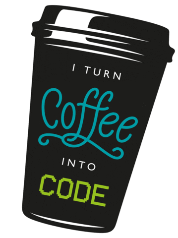

##  Hello World 👋🌎!

I'm Prateek Bansal and currently pursuing my engineering in the field of Computer Science.The best part about me is that I am eager to learn.Although sometimes feel frustrated on not getting appropriate results ,but that motivates me to even work harder.I have experiences in many programming languages like C++, Java, Javascript . I'm a full stack NodeJs developer,stepping in React development....In some parallel world I'm a gym bunny💪..❤ coffee ...play guitar.  

### Projects 👨‍💻
[BrainHealth](https://brain-health.herokuapp.com/) ||&nbsp;&nbsp; [LazzyList](https://mrpkdeveloper.github.io/LAZZY-LIST-/) || [Emoji-Slot-game](https://mrpkdeveloper.github.io/THE_MOOJI--SLOT-MACHINE-/)

- 🌱 I’m currently building some projects in NodeJs and React.
- 👯 I’m looking to collaborate on amazing web projects. 
- 📫 Connect Me on : [LinkedIn](https://www.linkedin.com/in/prateek-bansal-734b191a4?).
